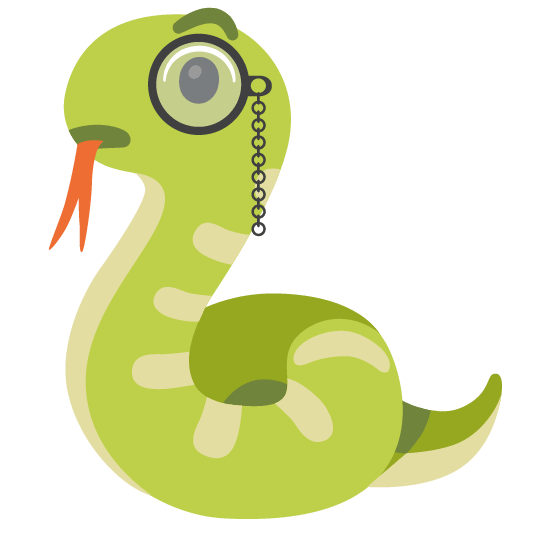

# COBRA: COntext-, BRanch- sensitive static Analysis Framework

COBRA is a Kotlin framework providing reusable components for building static analysis tools. The framework supports context-sensitive and branch-sensitive analysis.

COBRA provides components for control flow analysis, graph processing, and vulnerability detection. **CobraPHP** is a static analysis tool for PHP web applications built on the COBRA framework.

## 🛠️ Core Components

- **[framework](https://github.com/Cobra/framework)**: Core framework
- **[commons-graph](https://github.com/Cobra/commons-graph)**: Graph processing library with storage
- **[commons-value](https://github.com/Cobra/commons-value)**: Union value system with serialization
- **[externs-phpparser](https://github.com/Cobra/externs-phpparser)**: JVM wrapper for PHP-Parser

## 📦 Applications

- **[CobraPHP](https://github.com/Cobra/CobraPHP)**: PHP static analysis tool built on COBRA framework
  - Vulnerability types: XSS, SQL Injection, UUF, Code Injection, Cmd Injection
  - Analysis engine with caching
  - Reports with source and sink information

## 📊 Datasets & Resources

- **[Dataset-PHPDynCtrlflow](https://github.com/Cobra/Dataset-PHPDynCtrlflow)**: Dynamic control flow dataset
- **[Dataset-PHPSRCS](https://github.com/Cobra/Dataset-PHPSRCS)**: PHP source code dataset
- **[Dataset-PHPCVES](https://github.com/Cobra/Dataset-PHPCVES)**: PHP CVE dataset
- **[Dataset-PHPRepos](https://github.com/Cobra/Dataset-PHPRepos)**: Dataset for evaluating PHP security analysis tools
- **[Dataset-PHPTarpits](https://github.com/Cobra/Dataset-PHPTarpits)**: Test challenges for PHP static analysis
- **[CVE-Reports](https://github.com/Cobra/CVE-Reports)**: Vulnerability reports

## 🔬 Research

- NOT RELEASE YET

---

For questions or support, please contact the project maintainers or open an issue on GitHub.
